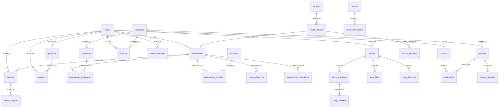

# データベース定義書

## 概要

| 項目 | 値 |
|------|-----|
| テーブル数 | 32 |
| RPC関数 | 6（+ トリガー関数 10+） |
| インデックス | 100+ |
| セキュリティ | 全テーブル RLS 有効 |

## ER図（主要テーブル）



---

## テーブル一覧

### 1. コアテーブル

#### users
ユーザープロフィール・認証データ

| カラム | 型 | 必須 | 説明 |
|--------|------|:----:|------|
| `id` | uuid PK | ✅ | auth.uid() にリンク |
| `email` | text | ✅ | メールアドレス |
| `first_name` | text | | 名 |
| `last_name` | text | | 姓 |
| `phone_number` | text | | 電話番号 |
| `date_of_birth` | date | | 生年月日 |
| `postal_code` | text | | 郵便番号 |
| `prefecture` | text | | 都道府県 |
| `city` | text | | 市区町村 |
| `address_line` | text | | 番地 |
| `building` | text | | 建物名 |
| `role` | text | ✅ | Admin / Staff / Partners / Members |
| `rank` | text | ✅ | Bronze / Silver / Gold / Platinum |
| `account_status` | text | | active / suspended / deactivated |
| `profile_visibility` | text | | プロフィール公開設定 |
| `show_email` | boolean | | メール公開フラグ |
| `show_phone` | boolean | | 電話公開フラグ |
| `email_notifications` | boolean | | メール通知 |
| `story_notifications` | boolean | | 体験記通知 |
| `rental_notifications` | boolean | | レンタル通知 |
| `comment_notifications` | boolean | | コメント通知 |
| `suspended_at` | timestamptz | | 停止日時 |
| `suspended_reason` | text | | 停止理由 |
| `created_at` | timestamptz | | 作成日時 |
| `updated_at` | timestamptz | | 更新日時 |

**RLS**: 自分のデータを読み書き可 / Admin は全データ閲覧・編集可

---

#### categories
動的カテゴリシステム

| カラム | 型 | 必須 | 説明 |
|--------|------|:----:|------|
| `id` | uuid PK | ✅ | |
| `type` | text | ✅ | equipment / partner / contact / vehicle |
| `key` | text | ✅ | カテゴリキー |
| `label_ja` | text | ✅ | 日本語ラベル |
| `label_en` | text | | 英語ラベル |
| `description` | text | | 説明 |
| `display_order` | integer | | 表示順 |
| `is_active` | boolean | | アクティブフラグ |
| `is_system` | boolean | | システムカテゴリ（削除不可） |

**RLS**: 全員閲覧可 / Admin のみ管理可

---

#### vehicles
車両カタログ（販売・レンタル）

| カラム | 型 | 必須 | 説明 |
|--------|------|:----:|------|
| `id` | uuid PK | ✅ | |
| `name` | text | ✅ | 車両名 |
| `type` | text | | キャブコン / バンコン 等 |
| `manufacturer` | text | | メーカー |
| `year` | integer | | 年式 |
| `price` | numeric | | 価格 |
| `purpose` | text | ✅ | sale / rental / both |
| `description` | text | | 説明 |
| `specs` | jsonb | | 仕様 |
| `features` | jsonb | | 装備 |
| `images` | jsonb | | 画像URL配列 |
| `status` | text | | ステータス |

**FK**: なし  
**RLS**: 全員閲覧可 / Admin・Staff のみ管理可

---

#### rental_vehicles
レンタル車両の料金・空き状況

| カラム | 型 | 必須 | 説明 |
|--------|------|:----:|------|
| `id` | uuid PK | ✅ | |
| `vehicle_id` | uuid FK | | → vehicles |
| `location` | text | | 保管場所 |
| `license_plate` | text | | ナンバープレート（管理者用） |
| `price_per_day` | numeric | ✅ | 日額料金 |
| `options` | jsonb | | オプション |
| `available_dates` | jsonb | | 利用可能日 |
| `unavailable_dates` | jsonb | | 利用不可日 |
| `maintenance_dates` | jsonb | | メンテナンス日 |
| `status` | text | | Available / OnRent / Returned / Maintenance |

**RLS**: 全員閲覧可 / Admin・Staff のみ管理可

---

#### equipment
レンタル機器カタログ

| カラム | 型 | 必須 | 説明 |
|--------|------|:----:|------|
| `id` | uuid PK | ✅ | |
| `name` | text | ✅ | 機器名 |
| `description` | text | | 説明 |
| `category` | text | | カテゴリ（旧） |
| `category_id` | uuid FK | | → categories |
| `price_per_day` | numeric | ✅ | 日額料金 |
| `pricing_type` | text | | PerDay / PerUnit |
| `quantity` | integer | | 在庫数 |
| `available_quantity` | integer | | 残数 |
| `specs` | jsonb | | 仕様 |
| `images` | jsonb | | 画像 |
| `status` | text | | ステータス |

**RLS**: 全員閲覧可 / Admin・Staff のみ管理可

---

#### activities
アクティビティカタログ

| カラム | 型 | 必須 | 説明 |
|--------|------|:----:|------|
| `id` | uuid PK | ✅ | |
| `name` | text | ✅ | 名前 |
| `description` | text | | 説明 |
| `price` | numeric | | 料金 |
| `price_type` | text | | 料金タイプ |
| `duration` | text | | 所要時間 |
| `location` | text | | 場所 |
| `provider` | text | | 提供者 |
| `min_participants` | integer | | 最少参加者 |
| `max_participants` | integer | | 最大参加者 |
| `start_date` | date | | 開始日 |
| `end_date` | date | | 終了日 |
| `images` | jsonb | | 画像 |
| `included` | jsonb | | 含まれるもの |
| `requirements` | jsonb | | 必要条件 |
| `tags` | jsonb | | タグ |
| `status` | text | | ステータス |

**RLS**: 全員閲覧可 / Admin・Staff のみ管理可

---

#### partners
協力店情報

| カラム | 型 | 必須 | 説明 |
|--------|------|:----:|------|
| `id` | uuid PK | ✅ | |
| `name` | text | ✅ | 店舗名 |
| `type` | text | | RVパーク / レストラン 等 |
| `category_id` | uuid FK | | → categories |
| `description` | text | | 説明 |
| `address` | text | | 住所 |
| `latitude` | numeric | | 緯度 |
| `longitude` | numeric | | 経度 |
| `contact` | jsonb | | 連絡先情報 |
| `facilities` | jsonb | | 設備 |
| `pricing` | jsonb | | 料金情報 |
| `opening_hours` | jsonb | | 営業時間 |
| `images` | jsonb | | 画像 |
| `rating` | numeric | | 平均評価 |
| `review_count` | integer | | レビュー数 |
| `user_id` | uuid FK | | → users（登録ユーザー） |

**RLS**: 全員閲覧可 / Admin のみ管理可

---

### 2. 予約関連

#### reservations

| カラム | 型 | 必須 | 説明 |
|--------|------|:----:|------|
| `id` | uuid PK | ✅ | |
| `user_id` | uuid FK | | → users |
| `rental_vehicle_id` | uuid FK | | → rental_vehicles |
| `start_date` | date | ✅ | 開始日 |
| `end_date` | date | ✅ | 終了日 |
| `days` | integer | ✅ | 日数 |
| `subtotal` | numeric | ✅ | 小計 |
| `tax` | numeric | ✅ | 税額 |
| `total` | numeric | ✅ | 合計 |
| `options` | jsonb | | オプション |
| `payment_method` | text | | 支払い方法 |
| `payment_status` | text | | 支払い状態 |
| `status` | text | | Pending / Confirmed / InProgress / Cancelled / Completed |

**RLS**: 自分の予約を閲覧・管理可 / Admin・Staff は全予約管理可

#### reservation_equipment

| カラム | 型 | 必須 | 説明 |
|--------|------|:----:|------|
| `id` | uuid PK | ✅ | |
| `reservation_id` | uuid FK | | → reservations |
| `equipment_id` | uuid FK | | → equipment |
| `quantity` | integer | | 数量 |
| `days` | integer | ✅ | 日数 |
| `price_per_day` | numeric | ✅ | 日額 |
| `subtotal` | numeric | ✅ | 小計 |

#### reservation_activities

| カラム | 型 | 必須 | 説明 |
|--------|------|:----:|------|
| `id` | uuid PK | ✅ | |
| `reservation_id` | uuid FK | | → reservations |
| `activity_id` | uuid FK | | → activities |
| `date` | date | ✅ | 日付 |
| `participants` | integer | ✅ | 参加者数 |
| `price` | numeric | ✅ | 料金 |

---

### 3. コミュニティ

#### stories（体験記）

| カラム | 型 | 必須 | 説明 |
|--------|------|:----:|------|
| `id` | uuid PK | ✅ | |
| `author_id` | uuid FK | | → users |
| `title` | text | ✅ | タイトル |
| `content` | text | ✅ | 本文 |
| `excerpt` | text | | 抜粋 |
| `cover_image` | text | | カバー画像 |
| `images` | jsonb | | 画像配列 |
| `location` | text | | 場所 |
| `latitude` | numeric | | 緯度 |
| `longitude` | numeric | | 経度 |
| `tags` | jsonb | | タグ配列 |
| `status` | text | | Draft / Published / Archived |
| `likes` | integer | | いいね数 |
| `views` | integer | | 閲覧数 |

**RLS**: 公開済みは全員閲覧可 / 著者のみ管理可

#### story_questions / story_answers
ストーリーへの質問・回答。`story_id` → stories, `user_id` → users  
**RLS**: 全員閲覧可 / 認証ユーザーが投稿・自分のを編集削除可

#### story_likes / story_favorites / vehicle_favorites / partner_favorites
いいね・ブックマーク。`user_id` + 対象ID（story_id / rental_vehicle_id / partner_id）  
**RLS**: 自分の投票のみ管理可

#### questions（Q&A）

| カラム | 型 | 必須 | 説明 |
|--------|------|:----:|------|
| `id` | uuid PK | ✅ | |
| `title` | text | ✅ | タイトル |
| `content` | text | ✅ | 内容 |
| `category` | text | | カテゴリ |
| `author_id` | uuid FK | | → users |
| `status` | text | | Open / Resolved / Closed |
| `views` | integer | | 閲覧数 |
| `answer_count` | integer | | 回答数 |

**RLS**: 全員閲覧可 / 認証ユーザーが投稿・自分のを編集削除可 / Admin・Staff は全質問のステータス変更・削除可

#### answers

| カラム | 型 | 必須 | 説明 |
|--------|------|:----:|------|
| `id` | uuid PK | ✅ | |
| `question_id` | uuid FK | | → questions |
| `content` | text | ✅ | 内容 |
| `author_id` | uuid FK | | → users |
| `is_accepted` | boolean | | ベストアンサー |
| `helpful_count` | integer | | 役立った数 |

**RLS**: 全員閲覧可 / 認証ユーザーが投稿・自分のを編集削除可

#### reviews

| カラム | 型 | 必須 | 説明 |
|--------|------|:----:|------|
| `id` | uuid PK | ✅ | |
| `target_type` | text | ✅ | Vehicle / RentalVehicle / Partner / Activity |
| `target_id` | uuid | ✅ | 対象ID |
| `author_id` | uuid FK | | → users |
| `reservation_id` | uuid FK | | → reservations |
| `rating` | integer | | 1-5 |
| `title` | text | | タイトル |
| `content` | text | | 内容 |
| `pros` | jsonb | | 良い点 |
| `cons` | jsonb | | 悪い点 |
| `images` | jsonb | | 画像配列 |
| `is_published` | boolean | | 公開フラグ |

**RLS**: 公開済みは全員閲覧可 / 著者のみ編集削除可 / Staff は全管理可

#### review_helpfuls
レビューの「役立った」投票。`review_id` + `user_id`  
**RLS**: 全員閲覧可 / 自分の投票のみ管理可

---

### 4. イベント・通知

#### events

| カラム | 型 | 必須 | 説明 |
|--------|------|:----:|------|
| `id` | uuid PK | ✅ | |
| `title` | text | ✅ | タイトル |
| `description` | text | | 説明 |
| `event_date` | timestamptz | ✅ | 開催日 |
| `end_date` | timestamptz | | 終了日 |
| `location` | text | | 場所 |
| `location_type` | text | | Online / Offline |
| `max_participants` | integer | | 定員 |
| `organizer_id` | uuid FK | | → users |

**RLS**: 全員閲覧可 / 主催者・Admin のみ管理可

#### event_participants
`event_id` + `user_id` + `status`  
**RLS**: 自分の参加を管理可

#### announcements（お知らせ）

| カラム | 型 | 必須 | 説明 |
|--------|------|:----:|------|
| `id` | uuid PK | ✅ | |
| `title` | text | ✅ | タイトル |
| `content` | text | ✅ | 内容 |
| `category` | text | | カテゴリ |
| `priority` | text | | 優先度 |
| `published` | boolean | | 公開フラグ |
| `author_id` | uuid FK | | → users |

**RLS**: 公開は全員閲覧可 / Admin・Staff のみ管理可

#### notifications（通知）

| カラム | 型 | 必須 | 説明 |
|--------|------|:----:|------|
| `id` | uuid PK | ✅ | |
| `user_id` | uuid FK | | → users |
| `type` | text | ✅ | 通知タイプ |
| `message` | text | ✅ | メッセージ |
| `read_at` | timestamptz | | 既読日時 |
| `story_id` | uuid | | 関連体験記 |
| `question_id` | uuid | | 関連質問 |
| `answer_id` | uuid | | 関連回答 |

**RLS**: 自分の通知のみ閲覧・更新可

---

### 5. ルート計画

#### routes
`user_id`, `name`, `origin`, `destination`, 位置情報（origin_lat/lng, dest_lat/lng）, `is_public`, `description`  
**RLS**: 公開は全員閲覧可 / 自分のみ管理可

#### route_stops
`route_id` → routes, `partner_id` → partners, `stop_order`, `name`, `address`, 位置情報, `notes`  
**RLS**: 公開ルートは閲覧可 / 自分のルートのみ管理可

---

### 6. スタッフ管理

#### rental_checklists

| カラム | 型 | 説明 |
|--------|------|------|
| `id` | uuid PK | |
| `reservation_id` | uuid FK | → reservations |
| `checklist_type` | text | pre_rental / handover / return |
| `checklist_data` | jsonb | チェック項目データ |
| `notes` | text | メモ |
| `completed_by` | uuid FK | → users（完了者） |
| `completed_at` | timestamptz | 完了日時 |

**RLS**: Staff のみ管理可

#### equipment_preparations

| カラム | 型 | 説明 |
|--------|------|------|
| `id` | uuid PK | |
| `reservation_id` | uuid FK | → reservations |
| `equipment_id` | uuid | 機器ID |
| `equipment_name` | text | 機器名 |
| `quantity` | integer | 数量 |
| `prepared` | boolean | 準備完了フラグ |
| `prepared_by` | uuid FK | → users（準備者） |
| `prepared_at` | timestamptz | 準備日時 |

**RLS**: Staff のみ管理可

---

### 7. システム管理

#### contacts（お問い合わせ）

| カラム | 型 | 説明 |
|--------|------|------|
| `id` | uuid PK | |
| `user_id` | uuid FK | → users（nullable, 匿名可） |
| `name` | text | 名前 |
| `email` | text | メール |
| `phone_number` | text | 電話番号 |
| `subject` | text | 件名 |
| `message` | text | メッセージ |
| `category` | text | カテゴリ |
| `category_id` | uuid FK | → categories |
| `status` | text | pending / reviewing / resolved / closed |
| `priority` | text | low / normal / high / urgent |
| `assigned_to` | uuid FK | → users（担当者） |
| `admin_notes` | text | 管理メモ |

**RLS**: 認証・匿名ユーザーが作成可 / Admin・Staff が全管理可

#### admin_logs
`admin_id` → users, `action`, `target_table`, `target_id`, `details`(jsonb)  
**RLS**: Admin のみ閲覧可 / Admin・Staff が作成可

#### system_settings

| カラム | 型 | 説明 |
|--------|------|------|
| `id` | uuid PK | |
| `key` | text | 設定キー |
| `value` | text | 設定値 |
| `description` | text | 説明 |
| `payment_method` | text | 支払い方法（card_only / onsite_only / both） |
| `rank_settings` | jsonb | ランクシステム設定 |
| `updated_by` | uuid FK | → users（更新者） |

**RLS**: 全員閲覧可 / Admin のみ更新・挿入可

**登録済み設定キー（初期データ）**:

| key | デフォルト値 | 説明 |
|-----|-------------|------|
| `rental_enabled` | `true` | レンタル機能の有効/無効 |
| `partner_registration_enabled` | `true` | 協力店登録機能の有効/無効 |
| `user_registration_enabled` | `true` | ユーザー登録機能の有効/無効 |
| `max_rental_days` | `14` | レンタル可能な最大連続日数 |
| `payment_method` | `both` | 支払い方法（both / card_only / cash_only） |
| `hero_image_url` | _(空)_ | トップページヒーロー画像URL |
| `hero_title` | `どこでも、寝泊まりを。` | トップページタイトル |
| `hero_subtitle` | _(デフォルト文)_ | トップページサブタイトル |
| `rental_intro_title` | `車中泊レンタルの魅力` | レンタル紹介タイトル |
| `rental_intro_description` | _(デフォルト文)_ | レンタル紹介説明文 |
| `faq_items` | _(空)_ | FAQアイテム |

---

## 関数・トリガー

### RPC関数（database.types.ts に定義）

| 関数 | 引数 | 戻り値 | 説明 |
|------|------|--------|------|
| `check_user_role(allowed_roles)` | text[] | boolean | RLSポリシーでロールチェック |
| `calculate_total_spent(user_uuid)` | uuid | number | 累計利用金額（Completed予約） |
| `calculate_total_likes(user_uuid)` | uuid | number | いいね獲得数 |
| `calculate_total_posts(user_uuid)` | uuid | number | 公開済み体験記数 |
| `determine_user_rank(user_uuid)` | uuid | string | ランク判定 |
| `update_user_rank(user_uuid)` | uuid | void | ランク再計算・更新 |

### その他の関数（SQL直接定義）

| 関数 | 説明 |
|------|------|
| `handle_new_user()` | Auth 新規ユーザー作成時に public.users 自動作成 |
| `increment_story_views(uuid)` | ストーリー閲覧数 +1 |
| `increment_question_views(uuid)` | 質問閲覧数 +1 |
| `suspend_account(text)` | アカウント一時停止 |
| `reactivate_account()` | アカウント再アクティブ化 |
| `get_rank_discount_rate(text)` | ランク割引率取得 |
| `update_*_updated_at()` | updated_at 自動更新（トリガー） |

### 同期トリガー

| 関数 | 説明 |
|------|------|
| `sync_equipment_preparations()` | 予約作成時に機器準備レコード自動作成 |
| `sync_equipment_category()` | カテゴリ自動同期 |
| `sync_partners_category()` | 〃 |
| `sync_contacts_category()` | 〃 |

### ランク自動昇格トリガー

| トリガー | 発火条件 |
|---------|---------|
| `trigger_update_rank_on_reservation()` | 予約完了時 |
| `trigger_update_rank_on_story()` | 体験記公開時 |
| `trigger_update_rank_on_like()` | いいね追加時 |

### ランク条件

| ランク | 累計利用額 | いいね数 | 投稿数 | 割引率 |
|--------|-----------|---------|--------|--------|
| Bronze | - | - | - | 0% |
| Silver | ¥50,000+ | 10+ | 3+ | 5% |
| Gold | ¥200,000+ | 30+ | 10+ | 10% |
| Platinum | ¥500,000+ | 100+ | 30+ | 15% |

> 各条件はOR — いずれか1つ満たせば昇格

---

## マイグレーション

統合マイグレーションファイル: `supabase/migrations/20260207000000_complete_database_schema.sql`

### セットアップ手順

```bash
# Supabase CLI
supabase link --project-ref YOUR_PROJECT_REF
supabase db push

# または SQL エディタで手動実行
# 1. public スキーマ削除 → 再作成
# 2. マイグレーション SQL を貼り付けて実行
```

---

**最終更新**: 2026-02-14
