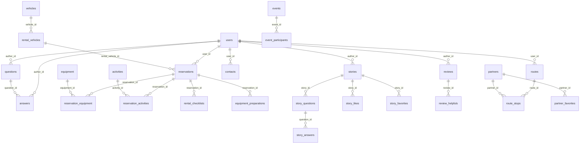

# データベース定義書

## 概要

| 項目 | 値 |
|------|-----|
| テーブル数 | 32 |
| 関数 | 17 |
| インデックス | 100+ |
| セキュリティ | 全テーブル RLS 有効 |

## ER図（主要テーブル）



---

## テーブル一覧

### 1. コアテーブル

#### users
ユーザープロフィール・認証データ

| カラム | 型 | 説明 |
|--------|------|------|
| `id` | uuid PK | auth.uid() にリンク |
| `email` | text | メールアドレス |
| `first_name`, `last_name` | text | 氏名 |
| `phone_number` | text | 電話番号 |
| `postal_code`, `prefecture`, `city`, `address_line`, `building` | text | 住所 |
| `role` | text | Admin / Staff / Partners / Members |
| `rank` | text | Bronze / Silver / Gold / Platinum |
| `email_notifications`, `story_notifications`, `rental_notifications`, `comment_notifications` | boolean | 通知設定 |
| `profile_visibility` | text | プロフィール公開設定 |
| `account_status` | text | active / suspended / deactivated |

**RLS**: 自分のデータを読み書き可 / Admin は全データ閲覧・編集可

---

#### categories
動的カテゴリシステム

| カラム | 型 | 説明 |
|--------|------|------|
| `id` | uuid PK | |
| `type` | text | equipment / partner / contact / vehicle |
| `key` | text | カテゴリキー |
| `label_ja`, `label_en` | text | 日本語・英語ラベル |
| `is_active` | boolean | アクティブフラグ |
| `is_system` | boolean | システムカテゴリ |

**RLS**: 全員閲覧可 / Admin のみ管理可

---

#### vehicles
車両カタログ（販売・レンタル）

| カラム | 型 | 説明 |
|--------|------|------|
| `id` | uuid PK | |
| `name` | text | 車両名 |
| `type` | text | キャブコン / バンコン 等 |
| `manufacturer` | text | メーカー |
| `year` | integer | 年式 |
| `price` | numeric | 価格 |
| `purpose` | text | sale / rental / both |
| `specs`, `features` | jsonb | 仕様・装備 |
| `images` | jsonb | 画像URL配列 |
| `status` | text | ステータス |

**RLS**: 全員閲覧可 / Admin・Staff のみ管理可

---

#### rental_vehicles
レンタル車両の料金・空き状況

| カラム | 型 | 説明 |
|--------|------|------|
| `id` | uuid PK | |
| `vehicle_id` | uuid FK | vehicles |
| `location` | text | 保管場所 |
| `price_per_day` | numeric | 日額料金 |
| `available_dates`, `unavailable_dates`, `maintenance_dates` | jsonb | 日付管理 |
| `status` | text | Available / OnRent / Returned / Maintenance |

**RLS**: 全員閲覧可 / Admin・Staff のみ管理可

---

#### equipment
レンタル機器カタログ

| カラム | 型 | 説明 |
|--------|------|------|
| `id` | uuid PK | |
| `name` | text | 機器名 |
| `category` | text | カテゴリ |
| `category_id` | uuid FK | categories |
| `price_per_day` | numeric | 日額料金 |
| `quantity`, `available_quantity` | integer | 在庫・残数 |
| `pricing_type` | text | PerDay / PerUnit |

**RLS**: 全員閲覧可 / Admin・Staff のみ管理可

---

#### partners
協力店情報

| カラム | 型 | 説明 |
|--------|------|------|
| `id` | uuid PK | |
| `name` | text | 店舗名 |
| `type` | text | RVパーク / レストラン 等 |
| `category_id` | uuid FK | categories |
| `address` | text | 住所 |
| `latitude`, `longitude` | numeric | 位置情報 |
| `contact`, `facilities`, `pricing`, `opening_hours` | jsonb | 詳細情報 |
| `rating` | numeric | 平均評価 |
| `review_count` | integer | レビュー数 |
| `user_id` | uuid FK | 登録ユーザー |

**RLS**: 全員閲覧可 / Admin のみ管理可

---

#### activities
アクティビティカタログ

| カラム | 型 | 説明 |
|--------|------|------|
| `id` | uuid PK | |
| `name` | text | 名前 |
| `description` | text | 説明 |
| `price` | numeric | 料金 |
| `price_type` | text | 料金タイプ |
| `duration` | text | 所要時間 |
| `location` | text | 場所 |
| `min_participants`, `max_participants` | integer | 参加者数 |

**RLS**: 全員閲覧可 / Admin・Staff のみ管理可

---

### 2. 予約関連

#### reservations

| カラム | 型 | 説明 |
|--------|------|------|
| `id` | uuid PK | |
| `user_id` | uuid FK | users |
| `rental_vehicle_id` | uuid FK | rental_vehicles |
| `start_date`, `end_date` | date | レンタル期間 |
| `days` | integer | 日数 |
| `status` | text | Pending / Confirmed / InProgress / Cancelled / Completed |
| `subtotal`, `tax`, `total` | numeric | 料金 |
| `payment_method`, `payment_status` | text | 支払い情報 |

**RLS**: 自分の予約を閲覧・管理可 / Admin・Staff は全予約管理可

#### reservation_equipment

| カラム | 型 | 説明 |
|--------|------|------|
| `reservation_id` | uuid FK | reservations |
| `equipment_id` | uuid FK | equipment |
| `quantity`, `days` | integer | 数量・日数 |
| `price_per_day`, `subtotal` | numeric | 料金 |

#### reservation_activities

| カラム | 型 | 説明 |
|--------|------|------|
| `reservation_id` | uuid FK | reservations |
| `activity_id` | uuid FK | activities |
| `date` | date | 日付 |
| `participants` | integer | 参加者数 |
| `price` | numeric | 料金 |

---

### 3. コミュニティ

#### stories（体験記）

| カラム | 型 | 説明 |
|--------|------|------|
| `id` | uuid PK | |
| `author_id` | uuid FK | users |
| `title`, `content`, `excerpt` | text | 記事内容 |
| `cover_image` | text | カバー画像 |
| `images` | jsonb | 画像配列 |
| `location` | text | 場所 |
| `latitude`, `longitude` | numeric | 位置情報 |
| `tags` | jsonb | タグ配列 |
| `status` | text | Draft / Published / Archived |
| `likes`, `views` | integer | いいね・閲覧数 |

**RLS**: 公開済みは全員閲覧可 / 著者のみ管理可

#### story_questions / story_answers
ストーリーへの質問・回答。**RLS**: 全員閲覧可 / 認証ユーザーが投稿・自分のを編集削除可

#### story_likes / story_favorites / vehicle_favorites / partner_favorites
いいね・ブックマーク。**RLS**: 自分の投票のみ管理可

#### questions（Q&A）

| カラム | 型 | 説明 |
|--------|------|------|
| `id` | uuid PK | |
| `title`, `content` | text | 内容 |
| `category` | text | カテゴリ |
| `author_id` | uuid FK | users |
| `status` | text | Open / Closed |
| `views` | integer | 閲覧数 |

**RLS**: 全員閲覧可 / 認証ユーザーが投稿・自分のを編集削除可

#### answers

| カラム | 型 | 説明 |
|--------|------|------|
| `question_id` | uuid FK | questions |
| `content` | text | 内容 |
| `author_id` | uuid FK | users |
| `is_accepted` | boolean | ベストアンサー |
| `helpful_count` | integer | 役立った数 |

**RLS**: 全員閲覧可 / 認証ユーザーが投稿・自分のを編集削除可

#### reviews

| カラム | 型 | 説明 |
|--------|------|------|
| `target_type` | text | Vehicle / RentalVehicle / Partner / Activity |
| `target_id` | uuid | 対象ID |
| `author_id` | uuid FK | users |
| `rating` | integer | 1-5 |
| `title`, `content` | text | 内容 |
| `pros`, `cons` | jsonb | 良い点・悪い点 |
| `images` | jsonb | 画像配列 |
| `is_published` | boolean | 公開フラグ |

**RLS**: 公開済みは全員閲覧可 / 著者のみ編集削除可 / Staff は全管理可

#### review_helpfuls
レビューの「役立った」投票。**RLS**: 全員閲覧可 / 自分の投票のみ管理可

---

### 4. イベント・通知

#### events

| カラム | 型 | 説明 |
|--------|------|------|
| `title`, `description` | text | 内容 |
| `event_date`, `end_date` | timestamptz | 開催日時 |
| `location` | text | 場所 |
| `location_type` | text | Online / Offline |
| `max_participants` | integer | 定員 |
| `organizer_id` | uuid FK | users |

**RLS**: 全員閲覧可 / 主催者・Admin のみ管理可

#### event_participants
イベント参加登録。**RLS**: 自分の参加を管理可

#### announcements（お知らせ）
`title`, `content`, `category`, `priority`, `published`。**RLS**: 公開は全員閲覧可 / Admin・Staff のみ管理可

#### notifications（通知）
`user_id`, `type`, `message`, `read_at`。**RLS**: 自分の通知のみ閲覧・更新可

---

### 5. ルート計画

#### routes
`user_id`, `name`, `origin`, `destination`, 位置情報, `is_public`。**RLS**: 公開は全員閲覧可 / 自分のみ管理可

#### route_stops
`route_id`, `partner_id`, `stop_order`, `name`, `address`, 位置情報。**RLS**: 公開ルートは閲覧可 / 自分のルートのみ管理可

---

### 6. スタッフ管理

#### rental_checklists
`reservation_id`, `checklist_type`(pre_rental/handover/return), `checklist_data`(jsonb), `completed_by`, `completed_at`。**RLS**: Staff のみ管理可

#### equipment_preparations
`reservation_id`, `equipment_id`, `equipment_name`, `quantity`, `prepared`, `prepared_by`。**RLS**: Staff のみ管理可

---

### 7. システム管理

#### contacts（お問い合わせ）

| カラム | 型 | 説明 |
|--------|------|------|
| `user_id` | uuid FK | nullable（匿名可） |
| `name`, `email`, `phone_number` | text | 連絡先 |
| `subject`, `message` | text | 内容 |
| `category` | text | カテゴリ |
| `status` | text | pending / reviewing / resolved / closed |
| `priority` | text | low / normal / high / urgent |
| `assigned_to` | uuid FK | 担当者 |

**RLS**: 認証・匿名ユーザーが作成可 / Admin・Staff が全管理可

#### admin_logs
`admin_id`, `action`, `target_table`, `target_id`, `details`(jsonb)。**RLS**: Admin のみ閲覧可 / Admin・Staff が作成可

#### system_settings

| カラム | 型 | 説明 |
|--------|------|------|
| `key` | text | 設定キー |
| `value` | text | 設定値 |
| `description` | text | 説明 |
| `rank_settings` | jsonb | ランクシステム設定 |

**RLS**: 全員閲覧可 / Admin のみ更新可

---

## 関数・トリガー

### 認証・ユーティリティ

| 関数 | 説明 |
|------|------|
| `check_user_role(text[])` | RLSポリシーでロールチェック。SECURITY DEFINER |
| `handle_new_user()` | Auth 新規ユーザー作成時に `public.users` を自動作成 |
| `update_*_updated_at()` | `updated_at` を自動更新（トリガー） |

### ビュー・インクリメント

| 関数 | 説明 |
|------|------|
| `increment_story_views(uuid)` | ストーリー閲覧数 +1 |
| `increment_question_views(uuid)` | 質問閲覧数 +1 |

### アカウント

| 関数 | 説明 |
|------|------|
| `suspend_account(text)` | アカウント一時停止 |
| `reactivate_account()` | アカウント再アクティブ化 |

### 同期トリガー

| 関数 | 説明 |
|------|------|
| `sync_equipment_preparations()` | 予約作成時に機器準備レコードを自動作成 |
| `sync_equipment_category()` | カテゴリ自動同期 |
| `sync_partners_category()` | 〃 |
| `sync_contacts_category()` | 〃 |

### 会員ランクシステム

| 関数 | 説明 |
|------|------|
| `calculate_total_spent(uuid)` | 累計利用金額（Completed 予約） |
| `calculate_total_likes(uuid)` | いいね獲得数 |
| `calculate_total_posts(uuid)` | 公開済み体験記数 |
| `determine_user_rank(uuid)` | ランク判定（Platinum→Gold→Silver→Bronze の順にOR条件） |
| `update_user_rank(uuid)` | ランク再計算・更新 |
| `get_rank_discount_rate(text)` | ランク割引率取得 |

**ランクトリガー（自動昇格）:**
- 予約完了時 → `trigger_update_rank_on_reservation()`
- 体験記公開時 → `trigger_update_rank_on_story()`
- いいね追加時 → `trigger_update_rank_on_like()`

### ランク条件

| ランク | 累計利用額 | いいね数 | 投稿数 | 割引率 |
|--------|-----------|---------|--------|--------|
| Bronze | - | - | - | 0% |
| Silver | ¥50,000+ | 10+ | 3+ | 5% |
| Gold | ¥200,000+ | 30+ | 10+ | 10% |
| Platinum | ¥500,000+ | 100+ | 30+ | 15% |

> 各条件はOR — いずれか1つ満たせば昇格

---

## マイグレーション

統合マイグレーションファイル: `supabase/migrations/20260207000000_complete_database_schema.sql`

### セットアップ手順

```bash
# Supabase CLI
supabase link --project-ref YOUR_PROJECT_REF
supabase db push

# または SQL エディタで手動実行
# 1. public スキーマ削除 → 再作成
# 2. マイグレーション SQL を貼り付けて実行
```

---

**最終更新**: 2026-02-07
