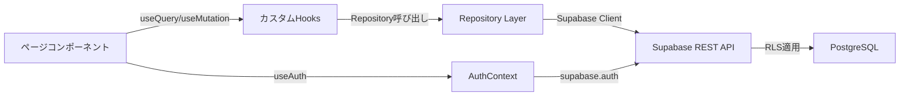
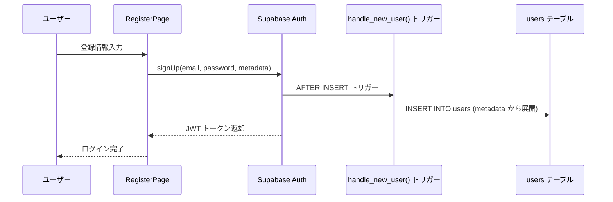
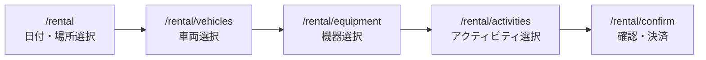

# Netomari（ネトマリ）開発引き継ぎ資料

> **最終更新**: 2026-02-11  
> **著者**: 吉田 浩樹
> **バージョン**: 1.0

---

## 目次

1. [システム概要](#1-システム概要)
2. [アーキテクチャ](#2-アーキテクチャ)
3. [技術スタック・依存関係](#3-技術スタック依存関係)
4. [プロジェクト構造](#4-プロジェクト構造)
5. [認証・権限管理](#5-認証権限管理)
6. [データベース設計](#6-データベース設計)
7. [データアクセス層](#7-データアクセス層)
8. [外部API連携](#8-外部api連携)
9. [主要機能の実装詳細](#9-主要機能の実装詳細)
10. [ルーティング一覧](#10-ルーティング一覧)
11. [開発環境セットアップ](#11-開発環境セットアップ)
12. [ビルド・デプロイ](#12-ビルドデプロイ)
13. [テスト](#13-テスト)
14. [既知の課題・今後の改善点](#14-既知の課題今後の改善点)
15. [関連ドキュメント](#15-関連ドキュメント)

---

## 1. システム概要

**Netomari（ネトマリ）** は車中泊・キャンピングカーライフを楽しむ人々のための総合コミュニティプラットフォームです。

### コンセプト
> 「どこでも、寝泊まりを。」

### 主要機能
| 機能カテゴリ | 内容 |
|---|---|
| 🚐 車両カタログ | 販売車両の一覧・詳細・レビュー |
| 🔑 レンタルフロー | 車両選択 → 機器選択 → アクティビティ選択 → 予約確認 |
| 📝 体験記 | Markdown 記事の投稿・いいね・ブックマーク・質問/回答 |
| ❓ Q&A | カテゴリ分類・ベストアンサー・役立った投票 |
| 🗺️ 協力店マップ | Leaflet 地図検索・カテゴリフィルター・お気に入り |
| 📍 寄り道ルート | ルートプランニング・経由地追加・保存/共有 |
| 🎉 イベント | オンライン/オフライン・参加登録・定員管理 |
| ⭐ レビュー | 5段階評価・良い点/悪い点・画像付き |
| 👥 ユーザー管理 | 4段階権限・会員ランク自動昇格・プロフィール管理 |
| 🛠️ 管理画面 | 15画面以上のAdmin/Staff管理機能 |

---

## 2. アーキテクチャ

### システム全体像

```
┌──────────────────────────────────────────────────────┐
│  React SPA (Vite + TypeScript)                        │
│                                                       │
│  Pages ─→ Hooks (useQuery / useMutation)              │
│         ─→ Repositories ─→ Supabase JS Client         │
│         ─→ Components (共有UI)                        │
│         ─→ Contexts (AuthContext)                     │
└──────────────────────┬───────────────────────────────┘
                       │ HTTPS
┌──────────────────────▼───────────────────────────────┐
│  Supabase Platform                                    │
│  ┌───────────┐ ┌──────────┐ ┌──────────────────────┐│
│  │ PostgreSQL│ │ Auth     │ │ Edge Functions       ││
│  │ + RLS     │ │          │ │ (create-payment-     ││
│  │ (32 tables)│ │          │ │  intent)             ││
│  └───────────┘ └──────────┘ └──────────┬───────────┘│
│  ┌───────────┐ ┌──────────┐            │            │
│  │ Storage   │ │ REST API │            │            │
│  │ (images)  │ │(PostgREST││            │            │
│  └───────────┘ └──────────┘            │            │
└────────────────────────────────────────┼────────────┘
     ┌────────────────────┐              │
     │ Google Maps API    │  ┌───────────▼───────────┐
     │ (Places検索)       │  │ Stripe (決済)          │
     └────────────────────┘  └───────────────────────┘
```

### データフロー



---

## 3. 技術スタック・依存関係

### コア技術

| レイヤー | 技術 | バージョン |
|---|---|---|
| 言語 | TypeScript | 5.5 |
| UI | React | 18.3 |
| ビルド | Vite | 5.4 |
| CSS | Tailwind CSS | 3.4 |
| ルーティング | React Router | v7 |
| 状態管理 | React Context + カスタムHooks | — |
| DB/Auth | Supabase | 2.57 |
| 地図 | Leaflet + React Leaflet | 1.9 / 4.2 |
| 施設検索 | Google Maps Places API | — |
| 決済 | Stripe | 8.7 |
| アイコン | Lucide React | 0.344 |
| フォーム | React Hook Form + Zod | 7.71 / 4.3 |
| 通知 | Sonner (Toast) | 2.0 |
| テスト | Vitest + Testing Library | — |
| Lint | ESLint + TypeScript-ESLint | — |

### package.json の主要依存関係

**本番:**
- `@googlemaps/js-api-loader` — Google Maps JS API のローダー
- `@stripe/stripe-js` — Stripe クライアントSDK
- `@supabase/supabase-js` — Supabase JS クライアント
- `leaflet` / `react-leaflet` — 地図コンポーネント
- `lucide-react` — アイコンライブラリ
- `react-hook-form` / `@hookform/resolvers` / `zod` — フォームバリデーション
- `react-error-boundary` — エラーバウンダリ
- `sonner` — トースト通知

**開発:**
- `@types/google.maps` / `@types/leaflet` — 型定義
- `vitest` / `jsdom` / `@testing-library/*` — テスト
- `autoprefixer` / `postcss` — CSS処理

---

## 4. プロジェクト構造

```
NetmariWeb/
├── public/                      # 静的ファイル
├── docs/
│   ├── API.md                   # API定義・認証・RLS・権限
│   ├── DATABASE.md              # テーブル定義・ER図・関数
│   └── HANDOVER.md              # 本ドキュメント
├── supabase/
│   ├── migrations/
│   │   └── 20260207000000_complete_database_schema.sql  # 統合マイグレーション
│   └── functions/
│       └── create-payment-intent/  # Stripe決済 Edge Function
├── scripts/                     # ユーティリティスクリプト
├── src/
│   ├── main.tsx                 # エントリポイント
│   ├── App.tsx                  # ルーティング定義（全82ルート）
│   ├── index.css                # グローバルCSS
│   ├── contexts/
│   │   └── AuthContext.tsx      # 認証コンテキスト（唯一のグローバル状態）
│   ├── hooks/
│   │   ├── useGoogleMapsLoader.ts   # Google Maps API ローダー
│   │   ├── useSystemSettings.ts     # システム設定の取得
│   │   └── useUnsavedChanges.ts     # 未保存変更の検出
│   ├── components/              # 共有コンポーネント（27ファイル）
│   │   ├── ProtectedRoute.tsx   # ルートガード（認証・ロール制御）
│   │   ├── Header.tsx           # グローバルヘッダー（モバイル対応）
│   │   ├── Footer.tsx           # フッター
│   │   ├── Layout.tsx           # Header + Footer ラッパー
│   │   ├── AdminLayout.tsx      # 管理画面レイアウト
│   │   ├── StaffSidebar.tsx     # スタッフサイドバー
│   │   ├── PlaceAutocomplete.tsx  # Google施設検索コンポーネント
│   │   ├── RouteMap.tsx         # Leaflet地図コンポーネント
│   │   ├── ImageUpload.tsx      # 画像アップロード
│   │   ├── ConfirmModal.tsx     # 確認ダイアログ
│   │   ├── LoadingSpinner.tsx   # ローディング
│   │   ├── EmptyState.tsx       # 空状態表示
│   │   ├── ErrorState.tsx       # エラー表示
│   │   ├── GlobalErrorBoundary.tsx  # グローバルエラーバウンダリ
│   │   ├── ScrollToTop.tsx      # ページ遷移時スクロールリセット
│   │   ├── category/            # カテゴリ関連コンポーネント
│   │   ├── partner/             # 協力店関連コンポーネント
│   │   ├── rental/              # レンタルフロー関連
│   │   └── route/               # ルート関連コンポーネント
│   ├── pages/                   # ページコンポーネント（67ファイル）
│   │   ├── HomePage.tsx         # トップページ
│   │   ├── LoginPage.tsx        # ログイン
│   │   ├── RegisterPage.tsx     # ユーザー登録
│   │   ├── MyPage.tsx           # マイページ（タブ切替）
│   │   ├── my-page/             # マイページタブコンポーネント（8ファイル）
│   │   │   ├── ProfileTab.tsx
│   │   │   ├── ReservationsTab.tsx
│   │   │   ├── FavoritesTab.tsx
│   │   │   ├── StoriesTab.tsx
│   │   │   ├── ReviewsTab.tsx
│   │   │   ├── RoutesTab.tsx
│   │   │   ├── SettingsTab.tsx
│   │   │   └── types.ts
│   │   ├── Rental*.tsx          # レンタルフロー（5ページ）
│   │   ├── Admin*.tsx           # 管理画面（15+ページ）
│   │   ├── Staff*.tsx           # スタッフ画面（3ページ）
│   │   └── Partner*.tsx         # 協力店画面（6ページ）
│   └── lib/
│       ├── supabase.ts          # Supabaseクライアント初期化
│       ├── database.types.ts    # DB型定義（supabase gen types で生成）
│       ├── logger.ts            # ログユーティリティ
│       ├── handleError.ts       # エラーハンドリング
│       ├── imageUpload.ts       # 画像アップロードユーティリティ
│       ├── schemas.ts           # Zod バリデーションスキーマ
│       └── data-access/         # データアクセス層（37ファイル）
│           ├── base/
│           │   ├── BaseRepository.ts   # 基底リポジトリクラス
│           │   ├── QueryBuilder.ts     # クエリビルダー
│           │   └── types.ts            # 共通型定義
│           ├── hooks/
│           │   ├── useQuery.ts         # データ取得フック
│           │   ├── useMutation.ts      # データ変更フック
│           │   └── useRepository.ts    # リポジトリ取得フック
│           └── repositories/           # テーブル固有リポジトリ（20個）
│               ├── ActivityRepository.ts
│               ├── AnnouncementRepository.ts
│               ├── AnswerRepository.ts
│               ├── CategoryRepository.ts
│               ├── ContactRepository.ts
│               ├── EquipmentRepository.ts
│               ├── EventRepository.ts
│               ├── EventParticipantRepository.ts
│               ├── PartnerRepository.ts
│               ├── QuestionRepository.ts
│               ├── RentalChecklistRepository.ts
│               ├── RentalFlowRepository.ts
│               ├── ReservationRepository.ts
│               ├── ReviewRepository.ts
│               ├── RouteRepository.ts
│               ├── StoryRepository.ts
│               ├── StoryQuestionRepository.ts
│               ├── SystemSettingsRepository.ts
│               ├── UserRepository.ts
│               └── VehicleRepository.ts
├── .env.sample                  # 環境変数テンプレート
├── package.json
├── vite.config.ts
├── tailwind.config.js
├── tsconfig.json / tsconfig.app.json / tsconfig.node.json
└── eslint.config.js
```

---

## 5. 認証・権限管理

### 認証方式

Supabase Auth を使用したメール/パスワード認証。JWT ベースのセッション管理。

### 認証フロー



### ユーザーロール

| ロール | 説明 | できること |
|---|---|---|
| `Admin` | 管理者 | 全機能・全ユーザー管理・システム設定変更 |
| `Staff` | スタッフ | 車両/機器管理・貸出/返却処理・予約管理・コンテンツ管理 |
| `Partners` | 協力店 | 自店舗ダッシュボード・レビュー管理 |
| `Members` | 一般会員 | レンタル予約・投稿・レビュー・お気に入り |

### 会員ランク

| ランク | 条件（いずれか） | 割引率 |
|---|---|---|
| Bronze | 初期状態 | 0% |
| Silver | 利用額5万円 or いいね10件 or 投稿3件 | 5% |
| Gold | 利用額20万円 or いいね30件 or 投稿10件 | 10% |
| Platinum | 利用額50万円 or いいね100件 or 投稿30件 | 15% |

ランクは `determine_user_rank()` RPC関数で自動計算されます。

### AuthContext の提供情報

`src/contexts/AuthContext.tsx` が提供するコンテキスト：

```typescript
interface AuthContextType {
  user: User | null;          // Supabase Auth ユーザー
  session: Session | null;    // セッション情報
  profile: UserProfile | null;// users テーブルのレコード
  loading: boolean;
  signUp / signIn / signOut;  // 認証操作
  isAdmin / isStaff / isPartner / isMember;  // ロール判定
  hasRole(roles: UserRole[]): boolean;
}
```

**使用例:**
```typescript
const { isAdmin, profile } = useAuth();
if (isAdmin) { /* Admin専用処理 */ }
```

### RLS（Row Level Security）

全32テーブルに RLS が有効。ポリシーは `check_user_role()` 関数を使用してロールベースのアクセス制御を実施。

**パターン:**
- 公開データ: `FOR SELECT USING (true)`
- 自己データ: `FOR ALL USING (auth.uid() = user_id)`
- スタッフ操作: `FOR ALL USING (check_user_role(ARRAY['Admin', 'Staff']))`
- 管理者操作: `FOR ALL USING (check_user_role(ARRAY['Admin']))`

### ルートガード（クライアントサイド）

`src/components/ProtectedRoute.tsx` が全保護ルートを制御:

| 動作条件 | アクション |
|---|---|
| 未ログイン | `/login?redirect=元URL` にリダイレクト |
| 権限不足 | `/` にリダイレクト + トースト通知 |
| ロード中 | スピナー表示 |

**使用例:**
```tsx
// ログイン必須のみ
<ProtectedRoute><MyPage /></ProtectedRoute>

// Admin限定
<ProtectedRoute allowedRoles={['Admin']}><AdminPage /></ProtectedRoute>

// Staff + Admin
<ProtectedRoute allowedRoles={['Admin', 'Staff']}><StaffPage /></ProtectedRoute>
```

> **二重防御:** RLS（サーバーサイド）+ ルートガード（クライアントサイド）の2層でアクセス制御を実施。

---

## 6. データベース設計

### テーブル一覧（32テーブル）

| # | カテゴリ | テーブル | 用途 |
|---|---|---|---|
| 1 | ユーザー | `users` | ユーザープロフィール・権限 |
| 2 | マスタ | `categories` | 動的カテゴリ（機器/協力店/問い合わせ/車両） |
| 3 | マスタ | `system_settings` | システム設定・ランク設定・支払い方法 |
| 4 | カタログ | `vehicles` | 車両（販売/レンタル/両方） |
| 5 | カタログ | `rental_vehicles` | レンタル車両（料金・ナンバー・ステータス） |
| 6 | カタログ | `equipment` | レンタル機器 |
| 7 | カタログ | `partners` | 協力店・施設 |
| 8 | カタログ | `activities` | アクティビティ |
| 9 | 予約 | `reservations` | レンタル予約 |
| 10 | 予約 | `reservation_equipment` | 予約に紐づく機器 |
| 11 | 予約 | `reservation_activities` | 予約に紐づくアクティビティ |
| 12-16 | 体験記 | `stories` / `story_questions` / `story_answers` / `story_likes` / `story_favorites` | 体験記・質問/回答・いいね・お気に入り |
| 17-18 | Q&A | `questions` / `answers` | 質問・回答 |
| 19-20 | レビュー | `reviews` / `review_helpfuls` | レビュー・役立った投票 |
| 21-22 | イベント | `events` / `event_participants` | イベント・参加登録 |
| 23-24 | お気に入り | `vehicle_favorites` / `partner_favorites` | 車両/協力店のお気に入り |
| 25 | 通知 | `notifications` | ユーザー通知 |
| 26-27 | ルート | `routes` / `route_stops` | 寄り道ルート・経由地 |
| 28-29 | 運用 | `rental_checklists` / `equipment_preparations` | 貸出チェック・機器準備 |
| 30 | 問い合わせ | `contacts` | お問い合わせ |
| 31 | 監査 | `admin_logs` | 管理操作ログ |
| 32 | お知らせ | `announcements` | お知らせ記事 |

### 統合マイグレーション

`supabase/migrations/20260207000000_complete_database_schema.sql`

新規環境でのセットアップには、このSQLを Supabase SQL エディタで実行するだけでOK。

### 主要なDB関数

| 関数 | 説明 |
|---|---|
| `check_user_role(text[])` | RLSポリシー用ロール判定 |
| `handle_new_user()` | Auth登録→usersテーブルへの自動INSERT |
| `update_updated_at_column()` | 全テーブルのupdated_at自動更新 |
| `calculate_total_spent(uuid)` | 利用合計額の計算 |
| `calculate_total_likes(uuid)` | いいね合計の計算 |
| `calculate_total_posts(uuid)` | 投稿数の計算 |
| `determine_user_rank(uuid)` | ランク判定ロジック |
| `update_user_rank(uuid)` | ランク更新実行 |

詳細は [docs/DATABASE.md](./DATABASE.md) を参照。

---

## 7. データアクセス層

### アーキテクチャ

```
ページ → useQuery/useMutation → Repository → Supabase Client → PostgreSQL
```

### BaseRepository

`src/lib/data-access/base/BaseRepository.ts` が全リポジトリの基底クラス。
以下の共通CRUDメソッドを提供：

| メソッド | 説明 |
|---|---|
| `findById(id)` | ID指定で1件取得 |
| `findAll()` | 全件取得 |
| `create(data)` | 新規作成 |
| `update(id, data)` | 更新 |
| `delete(id)` | 削除 |

### リポジトリ一覧（20個）

| リポジトリ | テーブル | 主な追加メソッド |
|---|---|---|
| `UserRepository` | users | ロール変更、ランク更新 |
| `VehicleRepository` | vehicles, rental_vehicles | — |
| `RentalFlowRepository` | reservations 等 | `getAvailableVehicles()`, `checkOverlap()`, `createReservation()` |
| `ReservationRepository` | reservations | ステータス変更 |
| `EquipmentRepository` | equipment | 在庫管理 |
| `PartnerRepository` | partners | — |
| `ActivityRepository` | activities | — |
| `StoryRepository` | stories | いいね、お気に入り管理 |
| `StoryQuestionRepository` | story_questions, story_answers | — |
| `QuestionRepository` | questions, answers | ベストアンサー、役立った |
| `ReviewRepository` | reviews | — |
| `EventRepository` | events | — |
| `EventParticipantRepository` | event_participants | — |
| `AnnouncementRepository` | announcements | — |
| `ContactRepository` | contacts | — |
| `CategoryRepository` | categories | — |
| `RouteRepository` | routes, route_stops | — |
| `RentalChecklistRepository` | rental_checklists, equipment_preparations | チェックリスト管理 |
| `SystemSettingsRepository` | system_settings | — |
| `AnswerRepository` | answers | — |

### カスタムHooks

```typescript
// データ取得
const { data, loading, error, refetch } = useQuery(
  () => repository.findAll()
);

// データ変更
const { mutate, loading } = useMutation(
  (data) => repository.create(data),
  { onSuccess: () => refetch() }
);
```

### ビジネスロジック: レンタル予約バッファ

`RentalFlowRepository.getAvailableVehicles()` は、予約の前後 ±1日 をバッファとして確保し、準備・返却日を自動ブロックします。キャンセル済み予約は除外されます。

詳細は [docs/API.md](./API.md) を参照。

---

## 8. 外部API連携

### 8.1 Supabase

**用途:** データベース、認証、ストレージ、Edge Functions

| 機能 | 使用箇所 |
|---|---|
| Auth | 全認証処理 (`AuthContext.tsx`) |
| Database (REST) | 全データアクセス（Repository → supabase client） |
| Storage | 画像アップロード (`imageUpload.ts`) |
| Edge Functions | Stripe決済 (`create-payment-intent`) |

**設定:**
```env
VITE_SUPABASE_URL=<プロジェクトURL>
VITE_SUPABASE_ANON_KEY=<Anon Key>
```

### 8.2 Google Maps API

**用途:** 協力店・体験記の施設名検索（PlaceAutocomplete）

**必要なAPI:**
- Maps JavaScript API
- Places API（※旧版。Places API (New) ではない）

**実装ファイル:**
- `src/hooks/useGoogleMapsLoader.ts` — API ライブラリのローダー
- `src/components/PlaceAutocomplete.tsx` — 検索UIコンポーネント

**使用ページ:**
- `/admin/partners/new` (協力店登録)
- `/admin/partners/:id/edit` (協力店編集)
- `/portal/stories/new` (体験記投稿)
- `/portal/stories/:id/edit` (体験記編集)

**設定:**
```env
VITE_GOOGLE_MAPS_API_KEY=<APIキー>
```

> ⚠️ APIキーの HTTP リファラー制限に `http://localhost:5173/*` と本番ドメインを追加すること。

### 8.3 Stripe

**用途:** レンタル予約のオンライン決済

**実装:**
- `supabase/functions/create-payment-intent/` — Edge Function（サーバーサイド）
- `@stripe/stripe-js` — クライアントSDK

**フロー:**
```
予約確認 → Edge Function呼び出し → PaymentIntent作成 → Stripe決済画面 → 完了
```

**設定:**
```env
VITE_STRIPE_PUBLISHABLE_KEY=<公開キー>
# Edge Function側に STRIPE_SECRET_KEY を設定
```

---

## 9. 主要機能の実装詳細

### 9.1 レンタルフロー

4ステップの予約プロセス:



**状態管理:** セッションストレージ + URLパラメータで選択状態をステップ間で保持。

**予約ステータス遷移:**
```
Pending → Confirmed → InProgress → Completed
                   ↘ Cancelled
```

**バッファ日制御:**
- 確定済み予約の前後±1日を自動ブロック
- `RentalFlowRepository.getAvailableVehicles()` と `checkOverlap()` で実装

### 9.2 体験記（Stories）

- Markdown ベースのリッチコンテンツ
- 位置情報（Google Places連携）
- いいね / ブックマーク
- 質問 / 回答のスレッド
- ステータス: Draft → Published → Archived

### 9.3 管理画面

`AdminLayout.tsx` + `StaffSidebar.tsx` がレイアウト・ナビゲーションを提供。

各管理ページは直接 `supabase` クライアントを呼び出すパターンと、Repository経由のパターンが混在しています。新規開発時は Repository パターンを推奨。

### 9.4 スタッフ画面

| ページ | URL | 機能 |
|---|---|---|
| ダッシュボード | `/staff` | 本日の貸出/返却一覧 |
| 貸出処理 | `/staff/checkout/:id` | チェックリストベースの貸出確認 |
| 返却処理 | `/staff/return/:id` | 返却チェック・状態確認 |

### 9.5 PlaceAutocomplete

`PlaceAutocomplete.tsx` は Google Places API を使って施設名を検索し、選択した施設の以下の情報を自動入力:

- 住所
- 電話番号
- メールアドレス
- 緯度・経度
- ウェブサイト

API が利用できない場合のフォールバック（手動入力モード）も実装済み。

### 9.6 支払い方法設定

`system_settings.payment_method` で管理者がシステム全体の支払い方法を切替可能:
- `card_only` — カード決済のみ
- `onsite_only` — 現地払いのみ
- `both` — 両方

`SystemSettingsPage.tsx` から設定変更可能。

---

## 10. ルーティング一覧

`src/App.tsx` で全ルートを定義。全ページは `lazy()` + `Suspense` で遅延読み込み。`ProtectedRoute` によるアクセス制御あり。

### 公開ページ（認証不要）
| パス | ページ |
|---|---|
| `/` | トップページ |
| `/vehicles` | 車両一覧 |
| `/vehicles/:id` | 車両詳細 |
| `/partners` | 協力店一覧 |
| `/partners/:id` | 協力店詳細 |
| `/portal` | ポータルトップ |
| `/portal/stories`, `/portal/stories/:id` | 体験記一覧・詳細 |
| `/portal/events`, `/portal/events/:id` | イベント一覧・詳細 |
| `/portal/questions`, `/portal/questions/:id` | Q&A一覧・詳細 |
| `/portal/announcements`, `/portal/news` | お知らせ一覧 |
| `/about` | サービス概要 |
| `/contact` | お問い合わせ |
| `/privacy` | プライバシーポリシー |
| `/terms` | 利用規約 |

### 認証
| パス | ページ |
|---|---|
| `/login` | ログイン |
| `/register` | ユーザー登録 |
| `/forgot-password` | パスワードリセット申請 |
| `/reset-password` | パスワード再設定 |
| `/auth/callback` | OAuth/メール確認コールバック |

### 認証必須ページ（ログインのみ必要、ロール不問）
| パス | ページ |
|---|---|
| `/rental` | レンタル（日付選択） |
| `/rental/vehicles` | 車両選択 |
| `/rental/equipment` | 機器選択 |
| `/rental/activities` | アクティビティ選択 |
| `/rental/confirm` | 確認・決済 |
| `/vehicles/review` | 車両レビュー投稿 |
| `/partners/:id/review` | 協力店レビュー |
| `/reviews/:id/edit` | レビュー編集 |
| `/portal/stories/new`, `.../edit` | 体験記投稿・編集 |
| `/portal/events/new`, `.../edit` | イベント作成・編集 |
| `/portal/questions/new`, `.../edit` | 質問投稿・編集 |
| `/route`, `/routes` | 寄り道ルート |
| `/my`, `/my-page`, `/mypage` | マイページ |

### Admin 専用ページ（`allowedRoles: ['Admin']`）
| パス | ページ |
|---|---|
| `/admin` | 管理ダッシュボード |
| `/admin/users` | ユーザー管理 |
| `/admin/vehicles`, `/new`, `/:id/edit` | レンタル車両管理 |
| `/admin/sale-vehicles`, `/new`, `/edit/:id` | 販売車両管理 |
| `/admin/equipment`, `/new`, `/:id/edit` | 機器管理 |
| `/admin/partners`, `/new`, `/:id/edit` | 協力店管理 |
| `/admin/activities` | アクティビティ管理 |
| `/admin/reservations` | 予約管理 |
| `/admin/stories` | 体験記管理 |
| `/admin/reviews` | レビュー管理 |
| `/admin/questions` | Q&A管理 |
| `/admin/contacts` | お問い合わせ管理 |
| `/admin/categories` | カテゴリ管理 |
| `/admin/content` | コンテンツ管理 |
| `/admin/news` | お知らせ管理 |
| `/admin/settings` | システム設定 |

### Staff + Admin ページ（`allowedRoles: ['Admin', 'Staff']`）
| パス | ページ |
|---|---|
| `/staff` | スタッフダッシュボード |
| `/staff/checkout/:id` | 貸出処理 |
| `/staff/return/:id` | 返却処理 |
| `/staff/contacts` | お問い合わせ |
| `/staff/stories` | 体験記管理 |
| `/staff/reviews` | レビュー管理 |
| `/staff/questions` | Q&A管理 |

### Partner + Admin ページ（`allowedRoles: ['Admin', 'Partners']`）
| パス | ページ |
|---|---|
| `/partner/dashboard` | 協力店ダッシュボード |

---

## 11. 開発環境セットアップ

### 前提条件
- Node.js 18+
- npm
- Supabase アカウント
- Google Cloud Console アカウント（Places API用）
- Stripe アカウント（決済機能用）

### セットアップ手順

```bash
# 1. リポジトリクローン
git clone git@github.com:tsa-slack/NetmariWeb.git
cd NetmariWeb

# 2. 依存関係インストール
npm install

# 3. 環境変数設定
cp .env.sample .env
# .env を編集（以下の値を設定）

# 4. 開発サーバー起動
npm run dev
# → http://localhost:5173
```

### 環境変数

| 変数名 | 説明 | 取得元 |
|---|---|---|
| `VITE_SUPABASE_URL` | SupabaseプロジェクトURL | Supabase Dashboard → Settings → API |
| `VITE_SUPABASE_ANON_KEY` | Supabase Anon Key | 同上 |
| `VITE_STRIPE_PUBLISHABLE_KEY` | Stripe公開キー | Stripe Dashboard → Developers → API keys |
| `VITE_GOOGLE_MAPS_API_KEY` | Google Maps APIキー | Google Cloud Console → 認証情報 |

### Google Maps API 設定

1. [Google Cloud Console](https://console.cloud.google.com/) でプロジェクト作成
2. **Maps JavaScript API** と **Places API** を有効化
3. 認証情報からAPIキーを作成
4. HTTPリファラー制限:
   - 開発: `http://localhost:5173/*`
   - 本番: `https://yourdomain.com/*`

### 開発コマンド

```bash
npm run dev        # 開発サーバー起動
npm run build      # 本番ビルド（dist/ に出力）
npm run preview    # ビルドプレビュー
npm run lint       # ESLint 実行
npm run typecheck  # TypeScript 型チェック
npm test           # Vitest テスト実行
npm run test:watch # テストウォッチモード
```

---

## 12. ビルド・デプロイ

### ビルド

```bash
npm run build
# → dist/ ディレクトリに静的ファイルが生成
```

### デプロイ先

**Vercel（推奨）** または **Netlify**

| 設定 | 値 |
|---|---|
| ビルドコマンド | `npm run build` |
| 出力ディレクトリ | `dist` |
| Node.js バージョン | 18+ |

### 環境変数（デプロイ先）

本番環境では以下の環境変数をデプロイ先（Netlify）の設定画面で登録:

```
VITE_SUPABASE_URL=<本番Supabase URL>
VITE_SUPABASE_ANON_KEY=<本番Supabase Anon Key>
VITE_STRIPE_PUBLISHABLE_KEY=<本番Stripe公開キー>
VITE_GOOGLE_MAPS_API_KEY=<本番Google Maps APIキー>
```

### Supabase Edge Functions のデプロイ

```bash
# Supabase CLI をインストール
npm install -g supabase

# プロジェクトリンク
supabase link --project-ref <PROJECT_REF>

# Edge Functions デプロイ
supabase functions deploy create-payment-intent

# Secret 設定（Stripeシークレットキー）
supabase secrets set STRIPE_SECRET_KEY=<キー>
```

### データベースのセットアップ

新規環境では `supabase/migrations/20260207000000_complete_database_schema.sql` を Supabase SQL エディタで実行。

---

## 13. テスト

### テスト構成

- **フレームワーク:** Vitest + jsdom
- **テストファイル:** `src/lib/data-access/base/__tests__/`, `src/lib/data-access/hooks/__tests__/`

### テスト実行

```bash
npm test           # 全テスト実行
npm run test:watch # ウォッチモード
```

### 手動テスト項目

`test.md` にシステム全体の手動テストケース（126項目）を記載。カバー範囲:

| カテゴリ | テスト数 |
|---|---|
| ゲスト操作 | 15 |
| ユーザー認証・登録 | 12 |
| レンタルフロー | 14 |
| コミュニティ機能 | 20 |
| マイページ | 18 |
| 管理画面 | 30 |
| スタッフ操作 | 10 |
| 協力店操作 | 7 |

---

## 14. 既知の課題・今後の改善点

### 技術的課題

| # | 課題 | 優先度 | 詳細 |
|---|---|---|---|
| ~~1~~ | ~~ルートガードの不在~~ | ~~高~~ | ✅ **解決済み** — `ProtectedRoute` コンポーネントで全保護ルートにガード適用（2026-02-14） |
| 2 | 管理画面の直接Supabase呼び出し | 中 | 一部の管理ページがRepositoryを使わず直接supabase clientを呼び出している |
| 3 | エラーハンドリングの一貫性 | 中 | ページによってエラーハンドリングのパターンが異なる |
| 4 | 画像最適化 | 低 | アップロード画像のリサイズ・圧縮が未実装 |
| 5 | i18n（多言語対応） | 低 | 現在は日本語のみ。categories テーブルに `label_en` は用意済み |

### 機能面の改善候補

| # | 項目 | 説明 |
|---|---|---|
| 1 | プッシュ通知 | `notifications` テーブルは存在するが、リアルタイム通知は未実装 |
| 2 | メール通知 | 予約確認・ステータス変更時のメール送信は未実装 |
| 3 | 検索機能の強化 | 全文検索（Supabase Full Text Search）の活用 |
| 4 | SEO対策 | SSR/SSG の導入検討（現在はSPA） |
| 5 | PWA化 | Service Worker によるオフライン対応 |
| 6 | アナリティクス | ユーザー行動分析の導入 |

---

## 15. 関連ドキュメント

| ドキュメント | パス | 内容 |
|---|---|---|
| README | [README.md](../README.md) | プロジェクト概要・セットアップ |
| API定義書 | [docs/API.md](./API.md) | API・認証・RLS・権限マトリクス |
| DB定義書 | [docs/DATABASE.md](./DATABASE.md) | テーブル定義・関数・ER図 |
| データアクセス層 | [src/lib/data-access/README.md](../src/lib/data-access/README.md) | Repository パターンの使い方 |
| マイグレーションガイド | [src/lib/data-access/MIGRATION_GUIDE.md](../src/lib/data-access/MIGRATION_GUIDE.md) | データアクセス層への移行手順 |
| テスト計画書 | [test.md](../test.md) | 全操作のシステムテストケース |

---

## 変更履歴

| 日付 | 著者 | 内容 |
|---|---|---|
| 2026-02-11 | 吉田 浩樹 | 初版作成 |
| 2026-02-14 | AI | ルートガード実装・ProtectedRoute 追加 |
