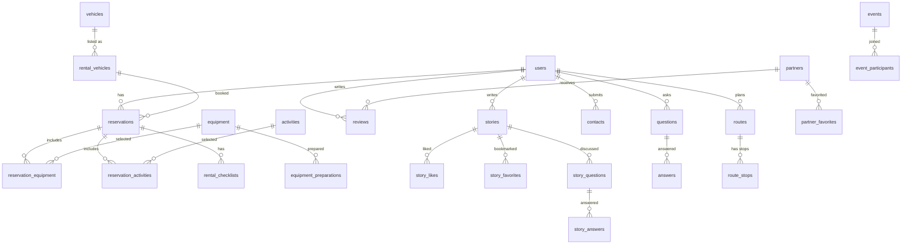
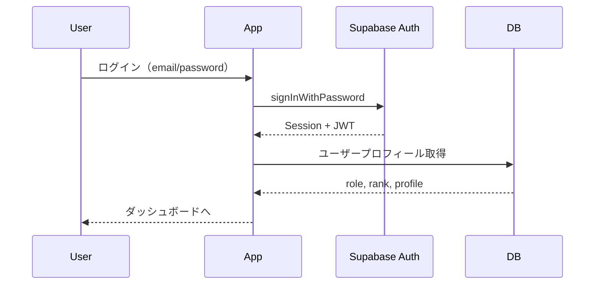

# システム詳細 — Netomari（ネトマリ）

> 全ページ・コンポーネント・データ層・データベース構成の詳細リファレンス

---

## 目次

1. [ルーティング（全ページ一覧）](#1-ルーティング全ページ一覧)
2. [コンポーネント構成](#2-コンポーネント構成)
3. [データアクセス層](#3-データアクセス層)
4. [データベース構成（全32テーブル）](#4-データベース構成全32テーブル)
5. [RPC関数・トリガー](#5-rpc関数トリガー)
6. [Edge Functions](#6-edge-functions)
7. [認証・セキュリティ](#7-認証セキュリティ)
8. [状態管理・Hooks](#8-状態管理hooks)

---

## 1. ルーティング（全ページ一覧）

### 公開ページ（認証不要）

| パス | ページ | 説明 |
|------|--------|------|
| `/` | `HomePage` | トップページ |
| `/login` | `LoginPage` | ログイン |
| `/register` | `RegisterPage` | 新規登録 |
| `/auth/callback` | `AuthCallbackPage` | OAuth コールバック |
| `/forgot-password` | `ForgotPasswordPage` | パスワード再設定リクエスト |
| `/reset-password` | `ResetPasswordPage` | パスワード再設定 |
| `/vehicles` | `VehiclesPage` | 車両一覧 |
| `/vehicles/:id` | `VehicleDetailPage` | 車両詳細 |
| `/partners` | `PartnersPage` | 協力店一覧 |
| `/partners/:id` | `PartnerDetailPage` | 協力店詳細 |
| `/portal` | `PortalPage` | コミュニティポータル |
| `/portal/stories` | `StoriesPage` | 体験記一覧 |
| `/portal/stories/:id` | `StoryDetailPage` | 体験記詳細 |
| `/portal/events` | `EventsPage` | イベント一覧 |
| `/portal/events/:id` | `EventDetailPage` | イベント詳細 |
| `/portal/questions` | `QuestionsPage` | Q&A 一覧 |
| `/portal/questions/:id` | `QuestionDetailPage` | Q&A 詳細 |
| `/portal/announcements` | `AnnouncementsPage` | お知らせ一覧 |
| `/about` | `AboutPage` | サービス紹介 |
| `/contact` | `ContactPage` | お問い合わせ |
| `/privacy` | `PrivacyPolicyPage` | プライバシーポリシー |
| `/terms` | `TermsOfServicePage` | 利用規約 |

### 認証必須ページ（ログインユーザー）

| パス | ページ | 説明 |
|------|--------|------|
| `/rental` | `RentalPage` | レンタルトップ（日付・場所選択） |
| `/rental/vehicles` | `RentalVehicleSelectionPage` | 車両選択 |
| `/rental/equipment` | `RentalEquipmentSelectionPage` | 装備品選択 |
| `/rental/activities` | `RentalActivitySelectionPage` | アクティビティ選択 |
| `/rental/confirm` | `RentalConfirmationPage` | 予約確認・決済 |
| `/vehicles/review` | `VehicleReviewFormPage` | 車両レビュー投稿 |
| `/partners/:id/review` | `PartnerReviewPage` | 協力店レビュー投稿 |
| `/reviews/:id/edit` | `ReviewEditPage` | レビュー編集 |
| `/portal/stories/new` | `StoryFormPage` | 体験記投稿 |
| `/portal/stories/:id/edit` | `StoryFormPage` | 体験記編集 |
| `/portal/events/new` | `EventFormPage` | イベント作成 |
| `/portal/events/:id/edit` | `EventFormPage` | イベント編集 |
| `/portal/questions/new` | `QuestionFormPage` | 質問投稿 |
| `/portal/questions/:id/edit` | `QuestionFormPage` | 質問編集 |
| `/routes` | `RoutePage` | ルートプランニング |
| `/mypage` | `MyPage` | マイページ（タブ構成） |

#### マイページ タブ構成

| タブ | コンポーネント | 内容 |
|------|--------------|------|
| プロフィール | `ProfileTab` | プロフィール表示・編集 |
| 予約 | `ReservationsTab` | 予約履歴・ステータス確認 |
| 体験記 | `StoriesTab` | 自分の体験記一覧 |
| レビュー | `ReviewsTab` | 自分のレビュー一覧 |
| ルート | `RoutesTab` | 保存済みルート |
| お気に入り | `FavoritesTab` | お気に入り車両・協力店 |
| 設定 | `SettingsTab` | 通知設定・アカウント設定 |

### Admin 専用ページ

| パス | ページ | 説明 |
|------|--------|------|
| `/admin` | `AdminPage` | 管理ダッシュボード |
| `/admin/reservations` | `ReservationManagementPage` | 予約管理（カレンダー/リスト） |
| `/admin/users` | `UserManagementPage` | ユーザー管理 |
| `/admin/vehicles` | `VehicleManagementPage` | レンタル車両管理 |
| `/admin/vehicles/new` | `VehicleFormPage` | レンタル車両登録 |
| `/admin/vehicles/:id/edit` | `VehicleFormPage` | レンタル車両編集 |
| `/admin/sale-vehicles` | `SaleVehicleManagementPage` | 販売車両管理 |
| `/admin/sale-vehicles/new` | `SaleVehicleFormPage` | 販売車両登録 |
| `/admin/sale-vehicles/edit/:id` | `SaleVehicleFormPage` | 販売車両編集 |
| `/admin/equipment` | `EquipmentManagementPage` | 装備品管理 |
| `/admin/equipment/new` | `EquipmentFormPage` | 装備品登録 |
| `/admin/equipment/:id/edit` | `EquipmentFormPage` | 装備品編集 |
| `/admin/partners` | `PartnerManagementPage` | 協力店管理 |
| `/admin/partners/new` | `PartnerFormPage` | 協力店登録 |
| `/admin/partners/:id/edit` | `PartnerFormPage` | 協力店編集 |
| `/admin/activities` | `ActivityManagementPage` | アクティビティ管理 |
| `/admin/stories` | `StoryManagementPage` | 体験記管理 |
| `/admin/reviews` | `ReviewManagementPage` | レビュー管理 |
| `/admin/questions` | `QuestionManagementPage` | Q&A 管理 |
| `/admin/contacts` | `ContactManagementPage` | お問い合わせ管理 |
| `/admin/categories` | `CategoryManagementPage` | カテゴリ管理 |
| `/admin/content` | `ContentManagementPage` | コンテンツ管理 |
| `/admin/news` | `NewsManagementPage` | お知らせ管理 |
| `/admin/settings` | `SystemSettingsPage` | システム設定 |

### Staff + Admin ページ

| パス | ページ | 説明 |
|------|--------|------|
| `/staff` | `StaffPage` | スタッフダッシュボード |
| `/staff/contacts` | `ContactManagementPage` | お問い合わせ管理 |
| `/staff/stories` | `StoryManagementPage` | 体験記管理 |
| `/staff/reviews` | `ReviewManagementPage` | レビュー管理 |
| `/staff/questions` | `QuestionManagementPage` | Q&A 管理 |
| `/staff/checkout/:id` | `StaffCheckoutPage` | 貸出手続き |
| `/staff/return/:id` | `StaffReturnPage` | 返却手続き |

### Partner + Admin ページ

| パス | ページ | 説明 |
|------|--------|------|
| `/partner/dashboard` | `PartnerDashboardPage` | 協力店ダッシュボード |

---

## 2. コンポーネント構成

### 共有コンポーネント（`src/components/`）

| コンポーネント | 説明 |
|--------------|------|
| `Layout` | 全体レイアウト（Header + Footer ラッパー） |
| `Header` | ナビゲーションヘッダー（ロール別メニュー） |
| `Footer` | フッター |
| `AdminLayout` | 管理画面サイドバーレイアウト |
| `StaffSidebar` | スタッフ/管理画面サイドバーナビゲーション |
| `ProtectedRoute` | 認証・ロール制御ルートガード |
| `LoadingSpinner` | ローディング表示 |
| `ConfirmModal` | 確認ダイアログ |
| `EmptyState` | データなし表示 |
| `ErrorState` | エラー表示 |
| `GlobalErrorBoundary` | グローバルエラーバウンダリ |
| `ScrollToTop` | ページ遷移時スクロールリセット |
| `ImageUpload` | 画像アップロード（Supabase Storage） |
| `PlaceAutocomplete` | Google Maps 施設検索入力 |
| `RouteMap` | Leaflet ルート地図表示 |

### 機能別コンポーネント

| ディレクトリ | コンポーネント | 説明 |
|-------------|--------------|------|
| `reservation/` | `ReservationCalendarMatrix` | 予約カレンダーマトリックス（車両×日付） |
| `reservation/` | `ReservationDetailModal` | 予約詳細+ステータス変更モーダル |
| `rental/` | 各種レンタルフロー部品 | 車両/装備品/アクティビティ選択UI |
| `partner/` | 協力店関連部品 | 協力店カード・詳細・フォーム部品 |
| `route/` | ルート関連部品 | ルート編集・経由地・地図部品 |
| `category/` | カテゴリ関連部品 | カテゴリ選択・管理部品 |

---

## 3. データアクセス層

### アーキテクチャ

```
src/lib/data-access/
├── base/
│   ├── BaseRepository.ts      # 抽象基底クラス（CRUD + エラーハンドリング）
│   ├── QueryBuilder.ts         # チェーン可能なクエリビルダー
│   ├── joinTypes.ts            # JOIN済み型定義
│   └── types.ts                # Result<T>, PaginatedResult<T> 等の共通型
├── hooks/
│   ├── useQuery.ts             # データ取得フック（キャッシュ + refetch）
│   └── useMutation.ts          # データ変更フック（楽観的更新対応）
└── repositories/               # テーブル固有リポジトリ（20個）
```

### リポジトリ一覧

| リポジトリ | テーブル | 主な責務 |
|-----------|---------|---------|
| `UserRepository` | `users` | ユーザー CRUD、プロフィール、ランク |
| `VehicleRepository` | `vehicles` | 車両 CRUD |
| `RentalFlowRepository` | `rental_vehicles`, `reservations` 等 | レンタル予約フロー全体 |
| `ReservationRepository` | `reservations` | 予約管理、カレンダーデータ、ステータス更新（RPC） |
| `EquipmentRepository` | `equipment` | 装備品 CRUD |
| `PartnerRepository` | `partners` | 協力店 CRUD |
| `ActivityRepository` | `activities` | アクティビティ CRUD |
| `StoryRepository` | `stories` | 体験記 CRUD（いいね・ブックマーク含む） |
| `StoryQuestionRepository` | `story_questions`, `story_answers` | 体験記 Q&A |
| `QuestionRepository` | `questions` | Q&A CRUD（回答・投票含む） |
| `AnswerRepository` | `answers` | Q&A 回答 |
| `ReviewRepository` | `reviews` | レビュー CRUD |
| `EventRepository` | `events` | イベント CRUD |
| `EventParticipantRepository` | `event_participants` | イベント参加管理 |
| `CategoryRepository` | `categories` | カテゴリ CRUD |
| `ContactRepository` | `contacts` | お問い合わせ CRUD |
| `AnnouncementRepository` | `announcements` | お知らせ CRUD |
| `RouteRepository` | `routes`, `route_stops` | ルート CRUD（経由地含む） |
| `RentalChecklistRepository` | `rental_checklists`, `equipment_preparations` | 貸出/返却チェックリスト |
| `SystemSettingsRepository` | `system_settings` | システム設定 CRUD |

---

## 4. データベース構成（全32テーブル）

### ER概要



### テーブル一覧（32テーブル）

#### コアテーブル

| テーブル | 説明 | 主要カラム |
|---------|------|-----------|
| `users` | ユーザー | id, email, role, rank, first_name, last_name |
| `categories` | カテゴリ | id, name, type |
| `system_settings` | システム設定 | id, key, value, category |

#### 車両・レンタル

| テーブル | 説明 | 主要カラム |
|---------|------|-----------|
| `vehicles` | 車両マスタ | id, name, type, description, specs |
| `rental_vehicles` | レンタル車両 | id, vehicle_id, license_plate, price_per_day, location |
| `equipment` | 装備品 | id, name, category, price_per_day, stock |
| `activities` | アクティビティ | id, name, duration, price, capacity |

#### 予約

| テーブル | 説明 | 主要カラム |
|---------|------|-----------|
| `reservations` | 予約 | id, user_id, rental_vehicle_id, start_date, end_date, status, total |
| `reservation_equipment` | 予約装備品 | id, reservation_id, equipment_id, quantity, days, subtotal |
| `reservation_activities` | 予約アクティビティ | id, reservation_id, activity_id, date, participants, price |
| `rental_checklists` | 貸出/返却チェックリスト | id, reservation_id, type, items, completed_at |
| `equipment_preparations` | 装備品準備 | id, reservation_id, equipment_id, status |

#### コミュニティ

| テーブル | 説明 |
|---------|------|
| `stories` | 体験記 |
| `story_questions` | 体験記への質問 |
| `story_answers` | 体験記質問への回答 |
| `story_likes` | 体験記いいね |
| `story_favorites` | 体験記ブックマーク |
| `questions` | Q&A 質問 |
| `answers` | Q&A 回答 |
| `reviews` | レビュー |
| `review_helpfuls` | レビュー「役立った」投票 |
| `events` | イベント |
| `event_participants` | イベント参加者 |

#### 協力店・ルート

| テーブル | 説明 |
|---------|------|
| `partners` | 協力店 |
| `partner_favorites` | 協力店お気に入り |
| `routes` | ルート |
| `route_stops` | ルート経由地 |

#### お気に入り・通知・管理

| テーブル | 説明 |
|---------|------|
| `vehicle_favorites` | 車両お気に入り |
| `notifications` | 通知 |
| `contacts` | お問い合わせ |
| `admin_logs` | 管理操作ログ |
| `announcements` | お知らせ |

---

## 5. RPC関数・トリガー

### RPC関数

| 関数名 | 説明 | セキュリティ |
|--------|------|-------------|
| `check_user_role(roles text[])` | ユーザーロール確認 | RLS ポリシーで使用 |
| `update_user_rank(user_id uuid)` | 会員ランク自動更新 | SECURITY DEFINER |
| `update_reservation_status(reservation_id, new_status)` | 予約ステータス更新 | SECURITY DEFINER（Admin/Staff のみ） |

### トリガー

| トリガー | テーブル | タイミング | 説明 |
|---------|---------|-----------|------|
| `trg_create_profile` | `users` | AFTER INSERT | Auth ユーザー作成時にプロフィール自動作成 |
| `trg_update_rank_on_story_publish` | `stories` | AFTER INSERT/UPDATE | 体験記公開時にランク更新 |
| `trg_update_rank_on_reservation_complete` | `reservations` | AFTER INSERT/UPDATE | 予約完了時にランク更新 |

---

## 6. Edge Functions

| 関数名 | パス | 説明 |
|--------|------|------|
| `create-payment-intent` | `/functions/create-payment-intent` | Stripe PaymentIntent 作成（レンタル決済） |

---

## 7. 認証・セキュリティ

### 認証フロー



### RLS ポリシー方針

- **全テーブルで RLS 有効**
- `check_user_role()` 関数で Admin/Staff 権限を判定
- 一般ユーザーは自分のデータのみ読み書き可能
- Admin/Staff は管理対象テーブルの全レコードにアクセス可能
- `SECURITY DEFINER` 関数で特定操作の RLS バイパス（ロールチェック付き）

---

## 8. 状態管理・Hooks

### Context

| Context | ファイル | 提供する情報 |
|---------|---------|-------------|
| `AuthContext` | `src/contexts/AuthContext.tsx` | user, session, role, rank, isAdmin, isStaff etc. |

### カスタム Hooks

| Hook | ファイル | 説明 |
|------|---------|------|
| `useSystemSettings` | `src/hooks/useSystemSettings.ts` | システム設定取得（キャッシュ付き） |
| `useGoogleMapsLoader` | `src/hooks/useGoogleMapsLoader.ts` | Google Maps API ローダー |
| `useUnsavedChanges` | `src/hooks/useUnsavedChanges.ts` | フォーム未保存変更警告 |

### データアクセス Hooks

| Hook | ファイル | 説明 |
|------|---------|------|
| `useQuery` | `src/lib/data-access/hooks/useQuery.ts` | リポジトリからのデータ取得（自動 refetch、enabled フラグ） |
| `useMutation` | `src/lib/data-access/hooks/useMutation.ts` | データ変更操作（楽観的更新、エラーハンドリング） |
