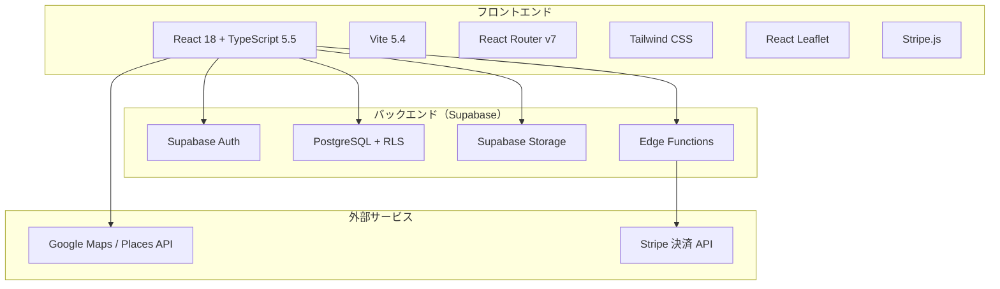
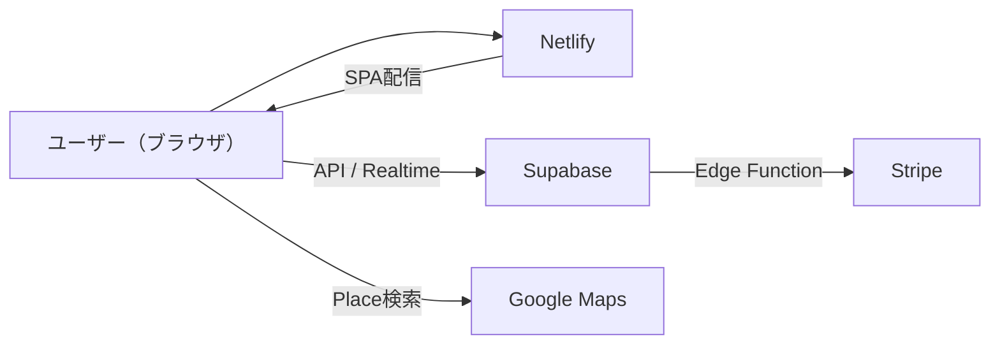

# システム概要 — Netomari（ネトマリ）

> 車中泊キャンピングカー コミュニティプラットフォーム  
> **「どこでも、寝泊まりを。」**

---

## 1. サービス概要

Netomari は、車中泊・キャンピングカーライフを楽しむ人々を対象とした**総合プラットフォーム**です。  
車両のレンタル予約から体験記の共有、協力店の検索、コミュニティ Q&A、イベント参加まで、車中泊に必要なあらゆる機能をワンストップで提供します。

### ビジネス価値

| 対象 | 価値 |
|------|------|
| **利用者（Members）** | 車両レンタル予約、体験記投稿・閲覧、ルート計画、Q&A、イベント参加、協力店検索 |
| **協力店（Partners）** | 店舗情報掲載、レビュー受付・管理、集客チャネル |
| **スタッフ（Staff）** | 貸出/返却オペレーション、予約・コンテンツ管理 |
| **管理者（Admin）** | 全機能管理、ユーザー管理、システム設定、ダッシュボード |

---

## 2. 技術スタック



| レイヤー | 技術 | 用途 |
|---------|------|------|
| フロントエンド | React 18 / TypeScript 5.5 / Vite 5.4 | SPA |
| スタイリング | Tailwind CSS | UI デザイン |
| ルーティング | React Router v7 | クライアントサイドルーティング |
| 地図 | React Leaflet / Google Maps Places API | 協力店検索・ルートプランニング |
| 決済 | Stripe（Edge Functions 経由） | レンタル決済 |
| BaaS | Supabase (PostgreSQL + Auth + Storage + Edge Functions) | 全バックエンド |
| セキュリティ | Row Level Security (RLS) 全テーブル | アクセス制御 |
| テスト | Vitest | ユニットテスト |

---

## 3. ユーザーロールと権限

4段階のロールベースアクセス制御（RBAC）:

```
Admin → Staff → Partners → Members
```

| ロール | 権限 | 対象ページ |
|--------|------|-----------|
| **Admin** | 全機能管理、ユーザー管理、システム設定 | `/admin/*`（24ルート） |
| **Staff** | 予約管理、貸出/返却、コンテンツ管理 | `/staff/*`（7ルート） |
| **Partners** | 協力店ダッシュボード、レビュー管理 | `/partner/*`（1ルート） |
| **Members** | レンタル予約、投稿、マイページ | `/mypage`, `/rental/*`, `/portal/*` |

### 会員ランク制度（自動昇格）

| ランク | 条件 | 特典 |
|--------|------|------|
| Bronze | 初回登録 | 基本料金 |
| Silver | 条件達成 | 割引適用 |
| Gold | 条件達成 | さらに割引 |
| Platinum | 条件達成 | 最大割引 |

---

## 4. 主要機能群

### 🚐 車両・レンタル

- 車両カタログ（販売用・レンタル用）
- レンタル予約フロー: 車両選択 → 装備品選択 → アクティビティ選択 → 確認・決済
- カレンダーマトリックスビュー（予約管理）
- 貸出/返却チェックリスト・装備品準備トラッキング
- バッファ日（準備日）管理

### 📝 コミュニティ

- **体験記**: Markdown エディタ、位置情報・画像、いいね・ブックマーク
- **Q&A**: カテゴリ分類、ベストアンサー、役立った投票
- **レビュー**: 5段階評価、良い点/悪い点、画像付き
- **イベント**: オンライン/オフライン、参加登録、定員管理

### 🗺️ 協力店・ルート

- 地図検索（Leaflet）、カテゴリフィルター、お気に入り
- ルートプランニング、経由地追加、保存/共有

### 🛠️ 管理機能

- 管理ダッシュボード
- ユーザー / 車両 / 装備 / 協力店 / アクティビティ / 予約管理
- コンテンツモデレーション（体験記・レビュー・Q&A）
- お問い合わせ / お知らせ / カテゴリ管理
- システム設定（最大レンタル日数、割引率等）

---

## 5. システム構成図



---

## 6. ドキュメント構成

| ドキュメント | 内容 |
|------------|------|
| `README.md` | プロジェクト概要・セットアップ手順 |
| `docs/SYSTEM_OVERVIEW.md` | **本ドキュメント** — システム全体像 |
| `docs/SYSTEM_DETAIL.md` | ページ・コンポーネント・DB 詳細 |
| `docs/API.md` | API定義・認証・RLS・権限マトリクス |
| `docs/DATABASE.md` | テーブル定義・関数・トリガー・ER図 |
| `docs/HANDOVER.md` | 引継ぎドキュメント |
| `src/lib/data-access/README.md` | データアクセス層の使用方法 |
